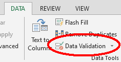
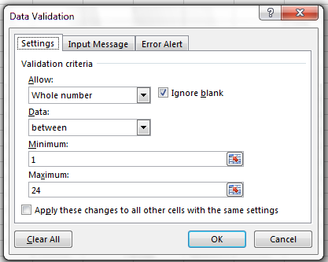
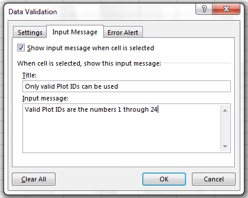
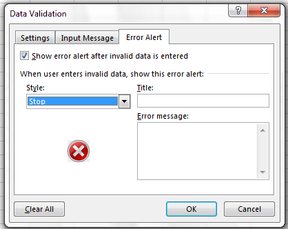
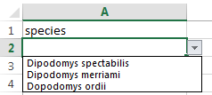

Authors:**Christie Bahlai**, **Aleksandra Pawlik** 
Contributors: **Jennifer Bryan**, **Alexander Duryee**, **Jeffrey Hollister**, **Daisie Huang**, **Owen Jones**,
**Ben Marwick**, and **Ethan White**

When you have a well-structured data table, you can use several simple
techniques within your spreadsheet to ensure the data you enter is free of
errors. These approaches include techniques that are implemented prior to entering
data (quality assurance) and techniques that are used after entering data to
check for errors (quality control).

# Quality Assurance

Quality assurance stops bad data from ever being entered by checking to see if
values are valid during data entry. For example, if research is being conducted
at sites A, B, and C, then the value V (which is right next to B on the
keyboard) should never be entered. Likewise if one of the kinds of data being
collected is a count, only integers greater than or equal to zero should be
allowed.

To control the kind of data entered into a a spreadsheet we use Data Validation
(Excel) or Validity (Libre Office Calc), to set the values that can be entered
in each data column.

1\. Select the cells or column you want to validate

2\. On the `Data` tab select `Data Validation`

3\. In the `Allow` box select the kind of data that should be in the
   column. Options include whole numbers, decimals, lists of items, dates, and
   other values.

   
4\. After selecting an item enter any additional details. For example if you've
   chosen a list of values then enter a comma-delimited list of allowable
   values in the `Source` box.

Let's try this out by setting the plot column in our spreadsheet to only allow
plot values that are integers between 1 and 24.

1. Select the `plot_id` column
2. On the `Data` tab select `Data Validation`
3. In the `Allow` box select `Whole number`
4. Set the minimum and maximum values to 1 and 24.

Now let's try entering a new value in the plot column that isn't a valid
plot. The spreadsheet stops us from entering the wrong value and asks us if we
would like to try again.

You can also customize the resulting message to be more informative by entering
your own message in the `Input Message` tab

and allow invalid data to just result in a warning by modifying the `Style`
option on the `Error Alert` tab.

Quality assurance can make data entry easier as well as more robust. For
example, if you use a list of options to restrict data entry, the spreadsheet
will provide you with a drop-downlist of the available items. So, instead of
trying to remember how to spell *Dipodomys spectabilis*, you can just select the
right option from the list.

# Quality Control

**Tip!** *Before doing any quality control operations, save your original file with the formulas and a name indicating it is the original data. Create a separate file with appropriate naming and versioning, and ensure your data is stored as “values” and not as formulas.  Because formulas refer to other cells, and you may be moving cells around, you may compromise the integrity of your data if you do not take this step!*

**readMe files:** As you start manipulating your data files, create a readMe document / text file to keep track of your files and document your manipulations so that they may be easily understood and replicated, either by your future self or by an independent researcher. Your readMe file should document all of the files in your data set (including documentation), describe their content and format, and lay out the organizing principles of folders and subfolders. For each of the separate files listed, it is a good idea to document the manipulations or analyses that were carried out on those data.

[Example: converting all data to values: use soybean aphid suction trap dataset for this section]

## Sorting ##
Bad values often sort to bottom or top of the column. For example, if your data should be numeric, then alphabetical and null data will group at the ends of the sorted data. Sort your data by each field, one at a time. Scan through each column, but pay the most attention to the top and the bottom of a column. 
If your dataset is well-structured and does not contain formulas, sorting should never affect the integrity of your dataset.

[Example: sorting]

## Conditional formatting ##
Use with caution! But a great way to flag inconsistent values when entering data.

[Example: conditional formatting]

## Check on cell formats ##
A good way to check if you’ve got data of the wrong type in a column is by checking column format. This can also help prevent issues when you export your data.

[Example: variable format]

## Pivot tables ##

Pivot tables are something that give you analytical power in Excel. If that
is your interest, there are many good on-line tutorials. However, because
of their lack of reproducibility and limited automation, we will focus in 
this workshop on other analytical approaches instead.

Previous:[Dates as data.](03-dates-as-data.html) Next: [Exporting data from spreadsheets.](05-exporting-data.html)
